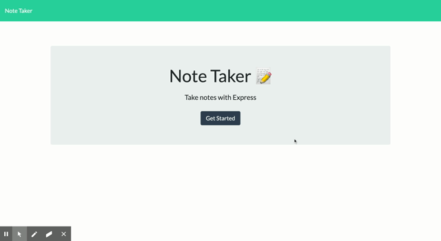

# Note Taker App

## Table of Contents

- [Description](#description)
- [Installation](#installation)
- [Technologies Used](#technologies-used)
- [Demo](#demo)

## Description

In this application you'll find a db.json file on the backend that will be used to store and retrieve notes using the fs module. API routes GET,POST,DELETE to help the apllication run smooth.

## Installation

To access the application run node server.js and open broweser go to http://localhost:3000 in your preferred browser.

## Technologies Used

- Node.js
- Express
- Javascript
- CSS
- HTML

## Demo

Deployed: [Note-Taker](https://stormy-reef-22729.herokuapp.com/)

